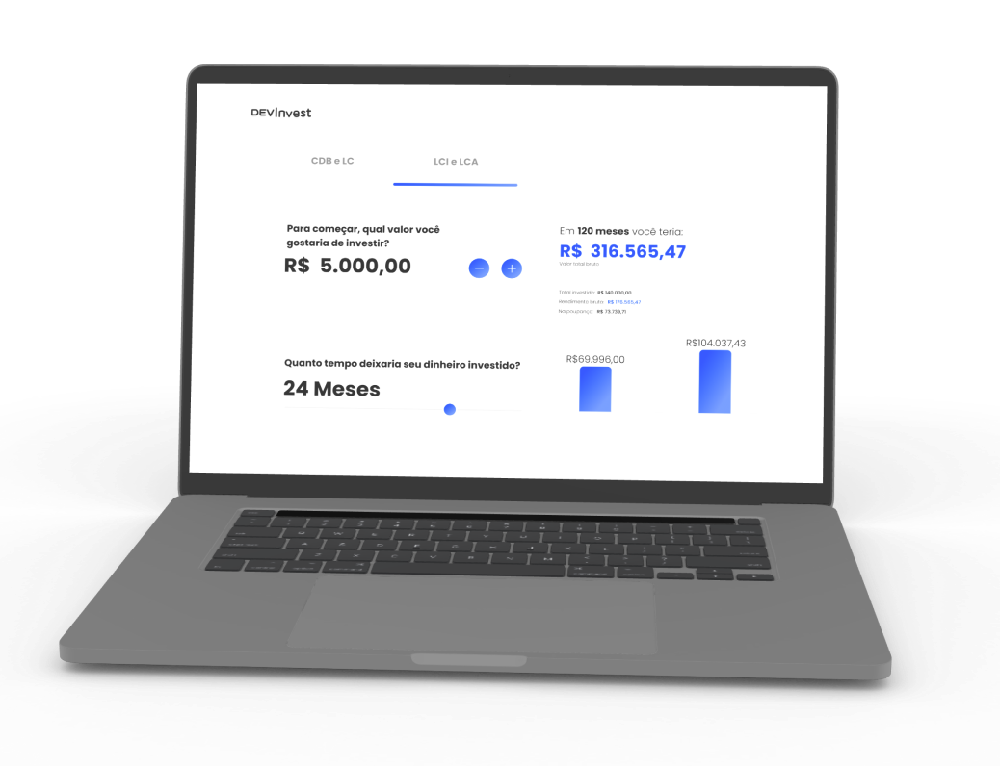

<div style="width: 100vw">
<p align="center">
  
</p>

<h4 align="center">
  Um simulador de investimentos com comparativos. Tudo isso na palma da sua mão.
</h4>

<p align="center">
  <a href="#test_tube-tecnologias">Tecnologias</a>&nbsp;&nbsp;&nbsp;|&nbsp;&nbsp;&nbsp;
  <a href="#rocket-início">Início</a>&nbsp;&nbsp;&nbsp;|&nbsp;&nbsp;&nbsp;
  <a href="#desktop_computer-projeto">Projeto</a>&nbsp;&nbsp;&nbsp;|&nbsp;&nbsp;&nbsp;
  <a href="#bookmark-layout">Layout</a>&nbsp;&nbsp;&nbsp;|&nbsp;&nbsp;&nbsp;
  <a href="#sunny-resultado">Resultado</a>
</p>

## :test_tube: Tecnologias

Esse projeto foi desenvolvido utilizando as seguintes tecnologias:

- [HTML](https://developer.mozilla.org/pt-BR/docs/Web/HTML)
- [CSSS](https://developer.mozilla.org/pt-BR/docs/Web/CSS)
- [ChartJs](https://www.chartjs.org/)

## :rocket: Início

Para clonar essa aplicação, você precisa do [Git](https://git-scm.com), [Node.js v18.17.1][nodejs] ou maior + [Yarn v1.22.19][yarn] ou maior instalado no seu computador.

No seu terminal clone esse projeto e acesse a pasta:

```bash
$ https://github.com/stack-code-dev/devInvest.git cd devInvest
```

## :desktop_computer: Projeto

O projeto é um simulador de investimento, no qual o usuário poderá calcular ganhos futuros com cada modalidade de investimento.

## :bookmark: Layout

Você poderá ver o layout através do link abaixo:

- [Layout Web](https://www.figma.com/file/oIQp2vzVSs4dawT9OFMXRc/Projeto-DEV-Inves?mode=dev)

Lembrando que é necessário ter uma conta no figma para acessar o projeto. [Figma](http://figma.com/)

---

## :sunny: Resultado

<h3>Layout responsivo:<h3>

  <div 
    style="
      display: flex;
      flex-direction: column;
      justify-content: center;
      align-items: center;
      width: 100vw;
      "
  >
      
      
  </div>

<p align="center">Made with ❤ by StackCode 🐺</p>

</div>
